# 📦 AWS RDS + ElastiCache (Redis) Cache-Aside Implementation

## 📌 Objective

To implement a **Cache-Aside (Side Cache) pattern** using Amazon RDS and Amazon ElastiCache (Redis) to reduce database load and improve response time for a high-traffic product catalog system.

---

## 🧠 Architecture Overview

```
User → EC2 (Application) → Redis (Cache) → RDS (Database)
```

* The application first checks Redis  
* On cache miss, it fetches data from RDS  
* Then stores data in Redis with TTL  

---

## 🚀 Step 1: VPC Setup

To build a secure and isolated network environment, a custom Virtual Private Cloud was created.

---

### 🔹 VPC Creation

* Created a custom VPC with CIDR block:
  ```
  10.0.0.0/16
  ```
* Provides a private network for AWS resources

---
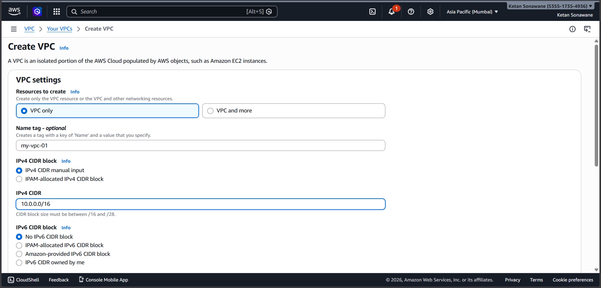

### 🔹 Subnet Configuration

#### 🟢 Public Subnet

* CIDR: `10.0.1.0/24`
* Used for:
  * EC2 (Application Server)
* Allows internet access

---
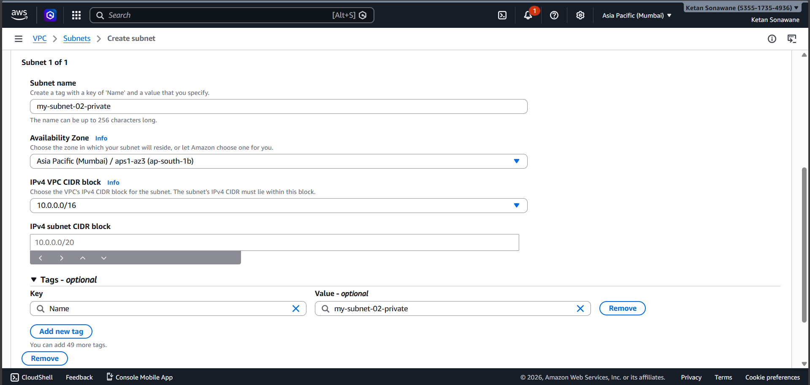


#### 🔒 Private Subnets

* CIDR:
  * `10.0.2.0/24`
  * `10.0.3.0/24`
* Used for:
  * RDS (Database)
  * Redis (ElastiCache)
* Not accessible from internet

---


### 🔹 Internet Gateway (IGW)

* Created and attached IGW to VPC
* Enables:
  * Public subnet ↔ Internet

---
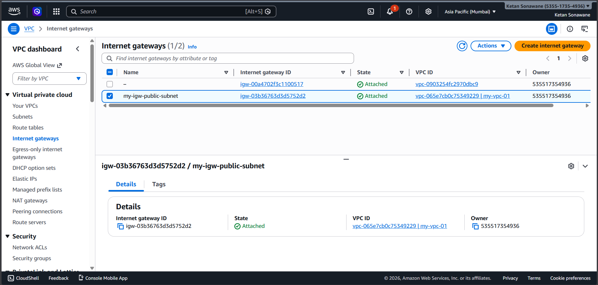

### 🔹 NAT Gateway

* Created NAT Gateway in public subnet
* Attached Elastic IP
* Allows private subnet resources to access internet securely

---
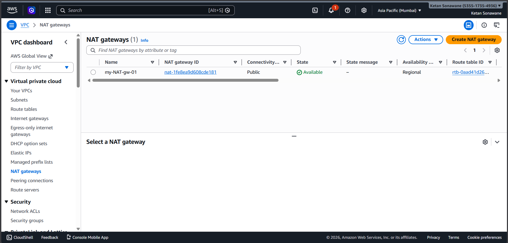
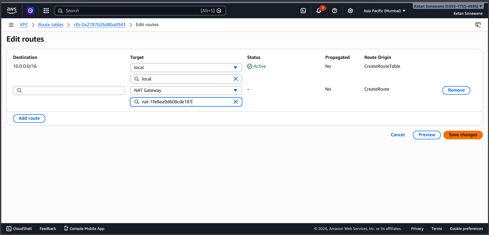

### 🔹 Route Tables

#### Private Route Table

* Route:
  ```
  0.0.0.0/0 → NAT Gateway
  ```

---
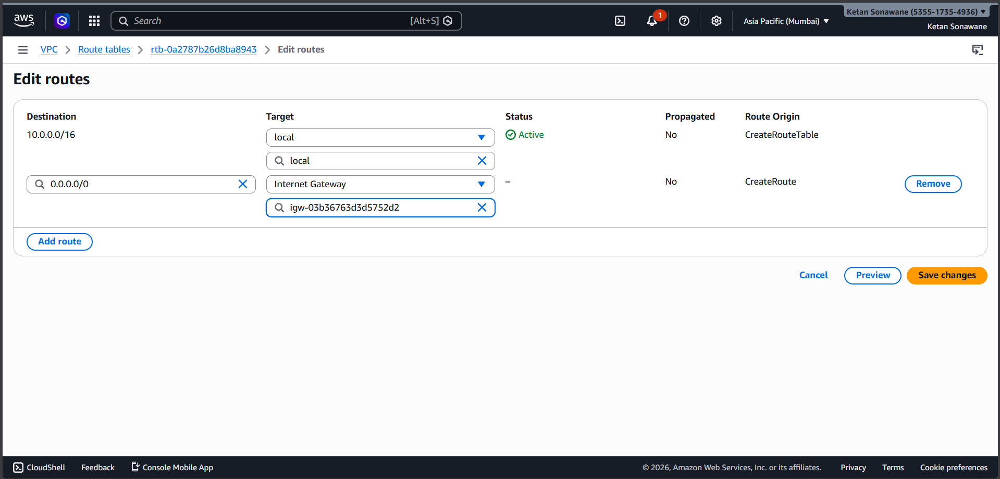

### ✅ Outcome

* EC2 can access internet  
* RDS and Redis remain secure  
* Architecture is production-like  

---

## 🔐 Step 2: Security Group Configuration

### App Server SG

* SSH (22) → My IP  
* HTTP (80) → Anywhere  

---
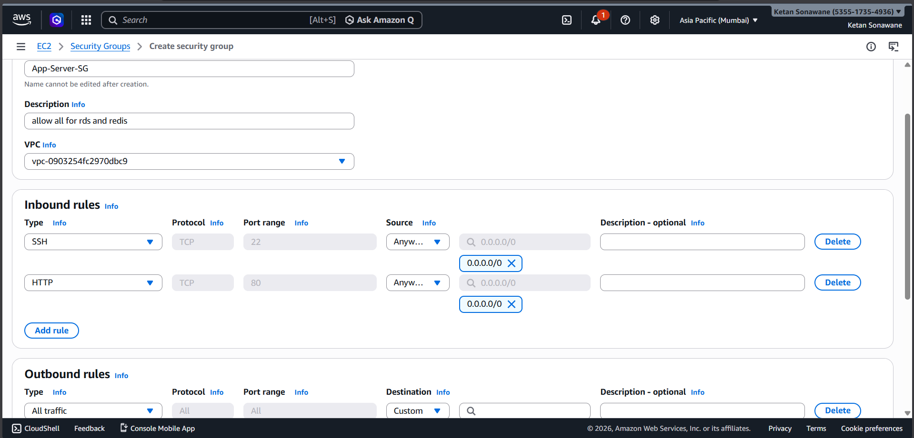

### RDS SG

* Port 3306 → Allowed only from App Server SG  

---
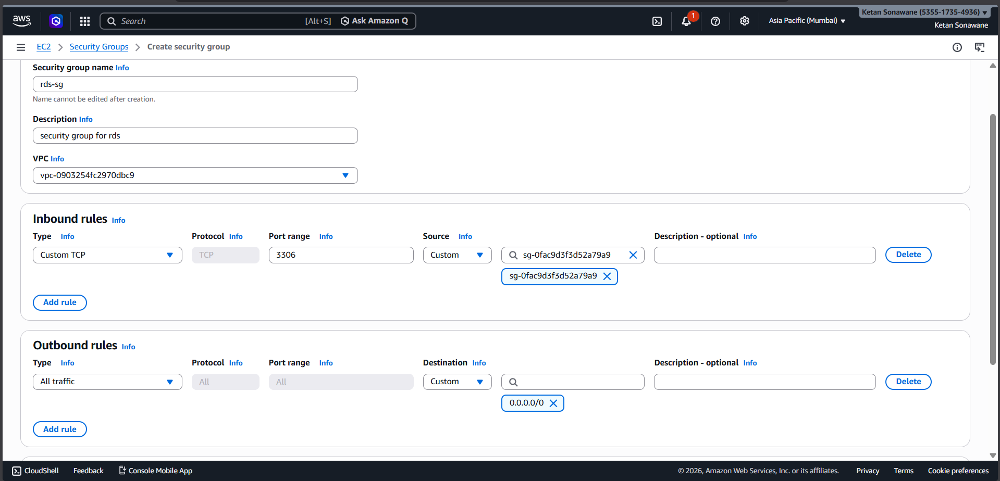

### Redis SG

* Port 6379 → Allowed only from App Server SG  

---
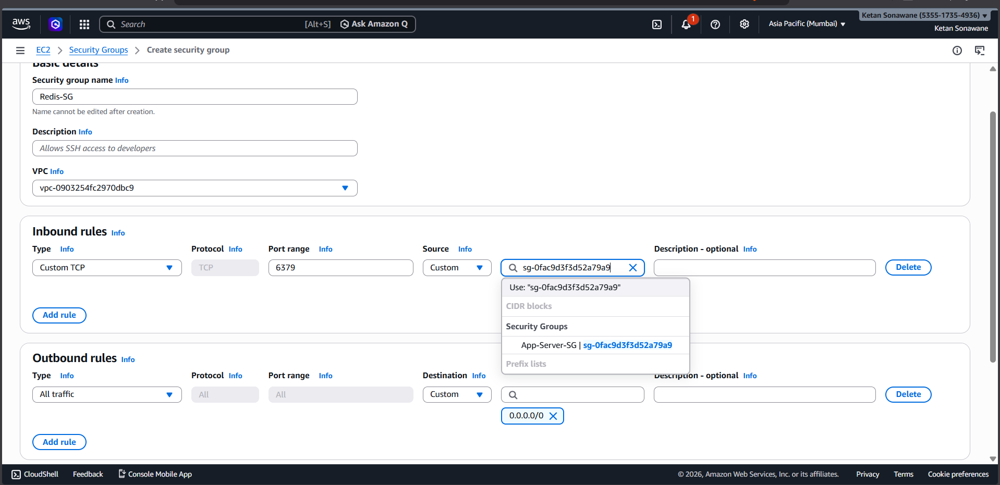

---

## 🗄️ Step 3: RDS Setup

* Service: Amazon RDS (MySQL)  
* Instance: db.t3.micro  
* Subnet: Private  
* Public Access: Disabled  
* Encryption: Enabled  

---

### Database Setup:

```sql
CREATE DATABASE testdb;
USE testdb;

CREATE TABLE products (
    id INT PRIMARY KEY,
    name VARCHAR(100),
    price INT,
    description TEXT
);

INSERT INTO products VALUES 
(1, 'Laptop', 50000, 'Gaming laptop'),
(2, 'Phone', 20000, 'Smartphone'),
(3, 'Headphones', 3000, 'Wireless headphones');
```

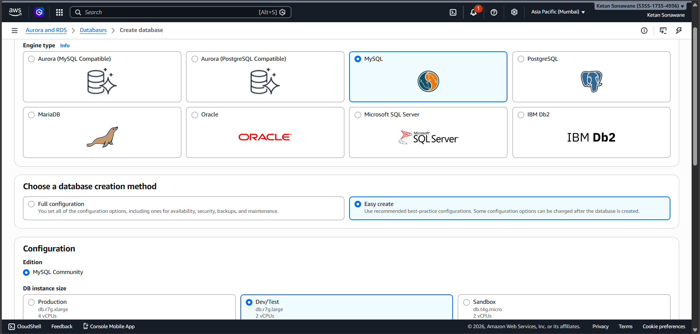
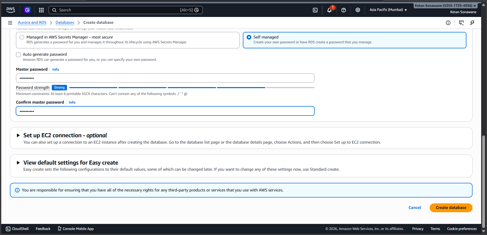
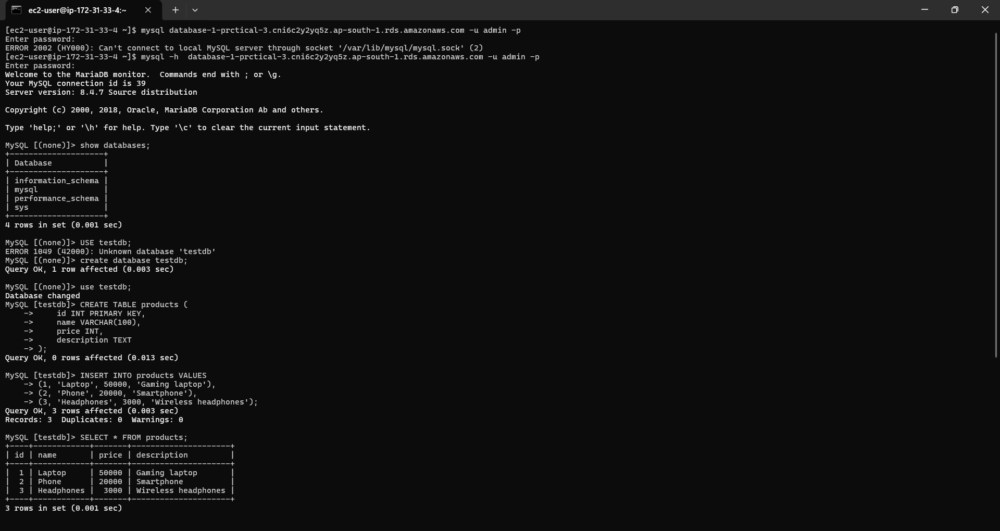

---

## ⚡ Step 4: ElastiCache (Redis) Setup

* Engine: Redis (Serverless)  
* Subnet: Private  
* Encryption in Transit: Enabled  
* Security Group: Redis SG  

📷 *[Insert Screenshot Here]*

---
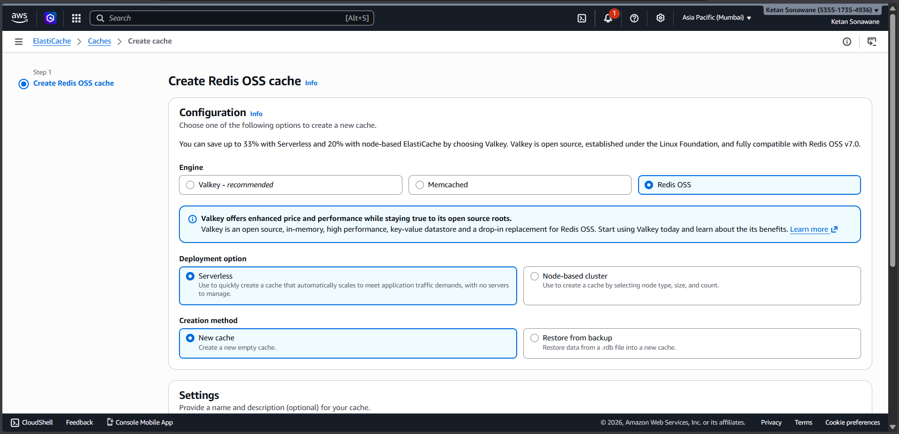


## 🖥️ Step 5: EC2 Setup

* Instance: Amazon EC2 (Amazon Linux)

---
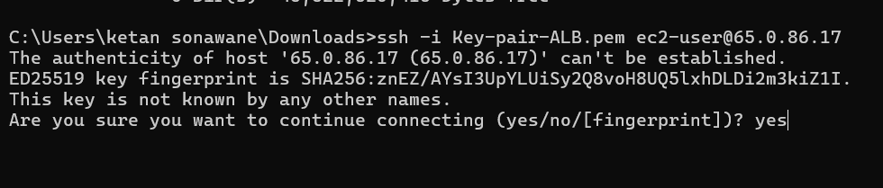

### Installed required tools:

```bash
sudo dnf install python3-pip mariadb105 redis6 -y
pip3 install redis pymysql
```

---

## 🔌 Step 6: Connectivity Testing

### RDS Connection

```bash
mysql -h  database-1-prctical-3.cni6c2y2yq5z.ap-south-1.rds.amazonaws.com -u admin -p
```

---

### Redis Connection

```bash
redis6-cli --tls -h my-cache-ok9oou.serverless.aps1.cache.amazonaws.com -p 6379 --insecure ping
```

---

### Expected Output:

```
PONG
```

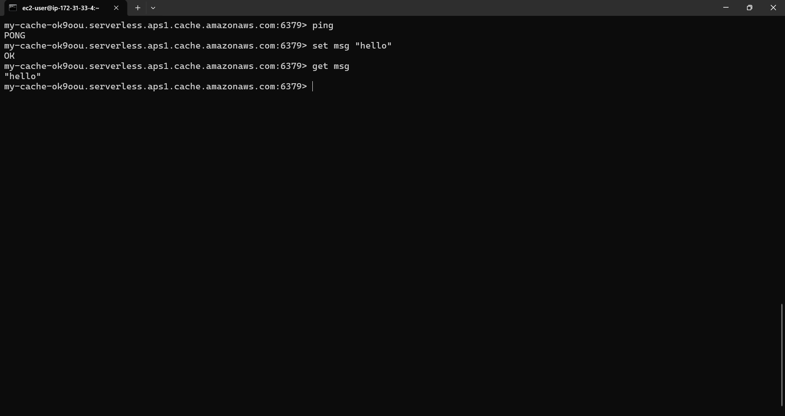

---

## 🧠 Step 7: Cache-Aside Implementation (Python)

```python
import redis
import pymysql
import json

cache = redis.Redis(
    host='my-cache-ok9oou.serverless.aps1.cache.amazonaws.com',
    port=6379,
    ssl=True,
    decode_responses=True
)

db = pymysql.connect(
    host='database-1-prctical-3.cni6c2y2yq5z.ap-south-1.rds.amazonaws.com',
    user='admin',
    password='my-password',
    database='testdb'
)

def get_product(product_id):
    key = f"product:{product_id}"

    cached = cache.get(key)
    if cached:
        print("Cache Hit")
        return json.loads(cached)

    print("Cache Miss")

    cursor = db.cursor()
    cursor.execute("SELECT * FROM products WHERE id=%s", (product_id,))
    row = cursor.fetchone()

    product = {
        "id": row[0],
        "name": row[1],
        "price": row[2],
        "description": row[3]
    }

    cache.setex(key, 60, json.dumps(product))

    return product

print(get_product(1))
print(get_product(1))
```
---
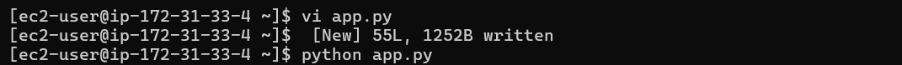

## Result : 
---


## ⏱️ Step 8: TTL Verification

### Command:

```bash
redis6-cli --tls -h <REDIS-ENDPOINT> -p 6379 --insecure ttl product:1
```

---

### Output:

```
(integer) 45
```

---
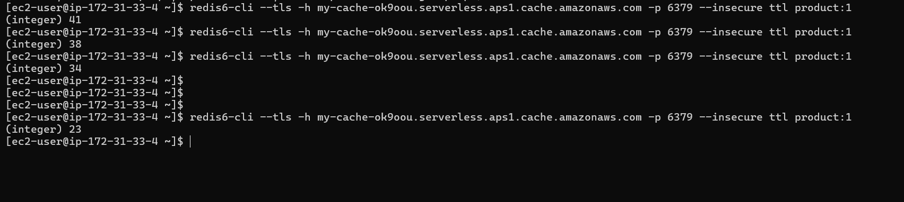
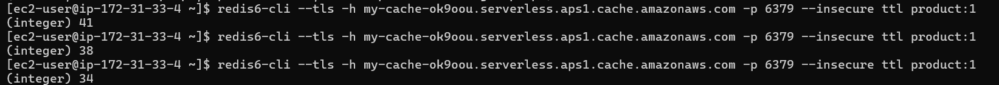

### Explanation:

* TTL ensures cached data expires automatically  
* Prevents stale data  

---


## ✅ Output

```
Cache Miss
Cache Hit
```

* First request → fetched from RDS  
* Second request → served from Redis  

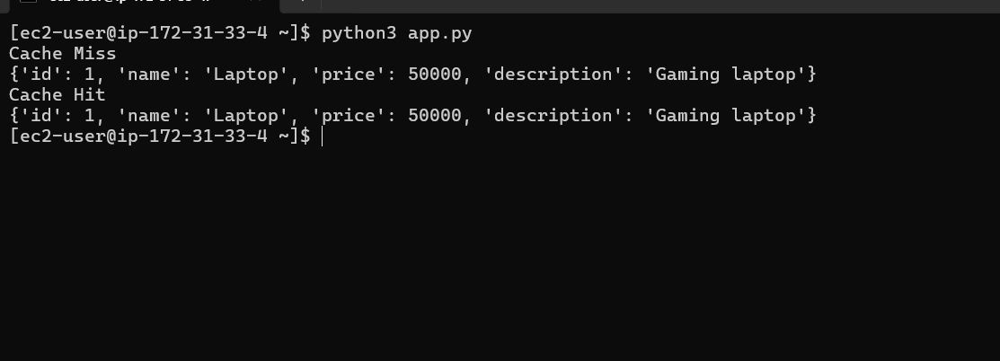

---

## 🎯 Conclusion

* Successfully implemented Cache-Aside pattern  
* Reduced database load  
* Improved response time  
* Ensured data freshness using TTL  

---

## 🧠 Key Learnings

* Importance of caching  
* Redis improves performance  
* Secure architecture using private subnets  
* TTL prevents stale data  

---

## 🏁 Result

✔ RDS + Redis in private subnet  
✔ Proper Security Groups  
✔ Lazy Loading implemented  
✔ TTL applied  

---

